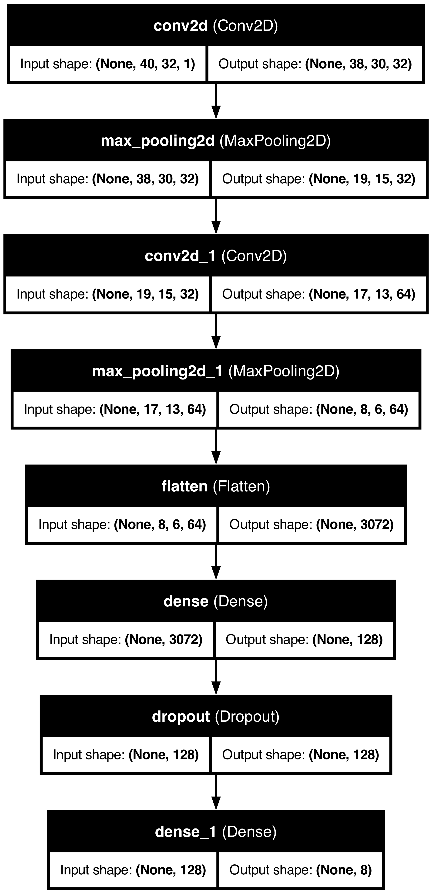
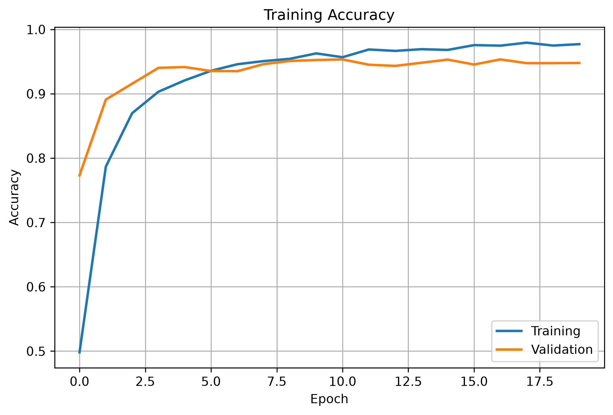
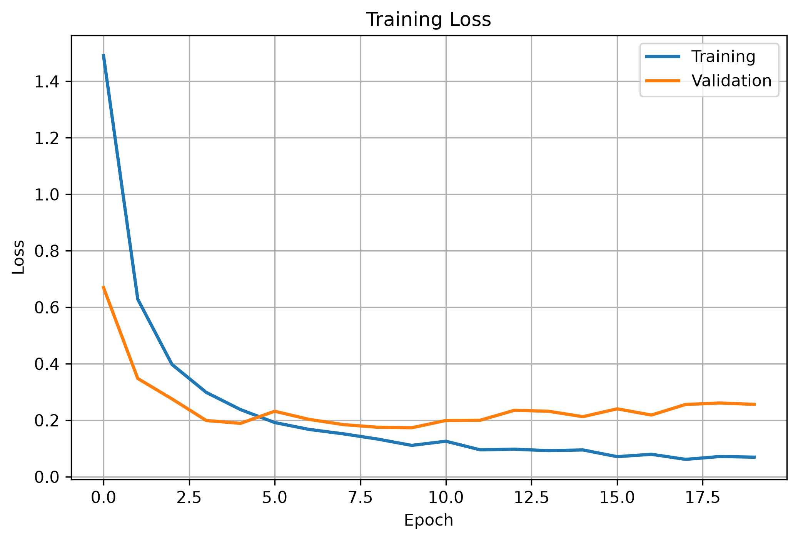
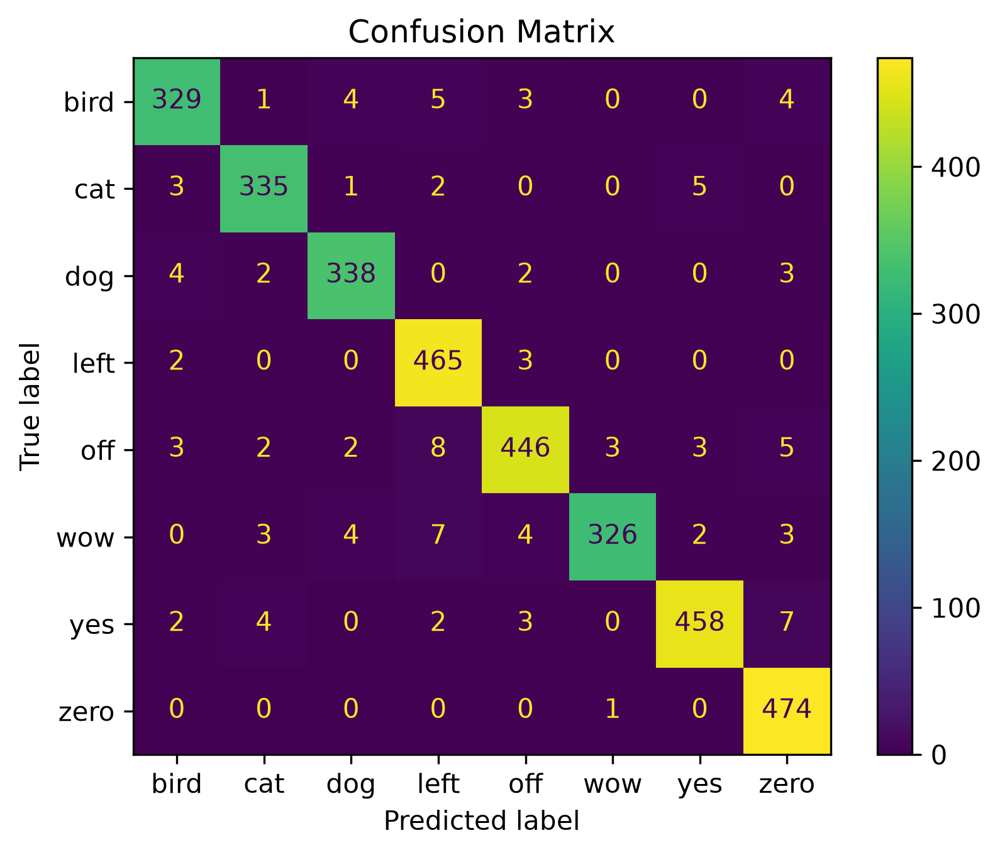
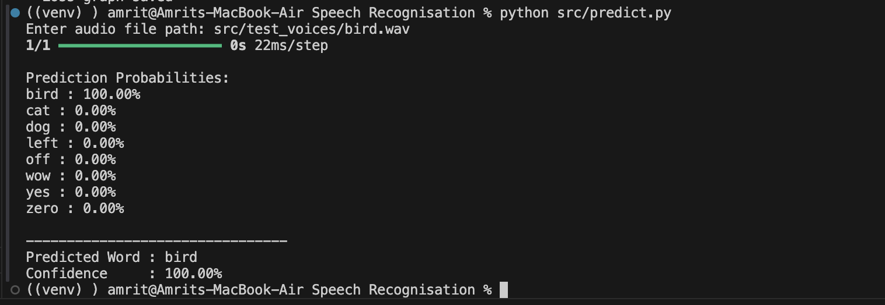

# 🎙️ Speech Recognition using Convolutional Neural Networks (CNN)

A deep learning-based speech recognition system that classifies spoken words using a Convolutional Neural Network (CNN). Audio recordings are converted into MFCC (Mel-Frequency Cepstral Coefficients) features, which are then used to train a CNN model for multi-class word classification.

---

## 🚀 Features

- 🎤 Recognizes spoken words from audio files
- 🧠 CNN built using TensorFlow/Keras
- 🎵 MFCC feature extraction using Librosa
- 📊 Training and validation accuracy visualization
- 📉 Training and validation loss visualization
- 📈 Confusion Matrix for performance evaluation
- 🔍 Predicts custom voice recordings
- 💾 Trained model saved for future inference

---

## 📂 Dataset

The dataset consists of spoken audio samples belonging to the following classes:

- Bird
- Cat
- Dog
- Left
- Off
- Wow
- Yes
- Zero

Each audio sample is converted into MFCC features before being fed into the CNN.

> **Note:** The original dataset is not included in this repository because of its large size.

---

# 🧠 CNN Architecture

The following figure illustrates the architecture of the CNN model used for speech recognition.



---

# 📈 Training Accuracy

Training and validation accuracy across epochs.



---

# 📉 Training Loss

Training and validation loss across epochs.



---

# 📊 Confusion Matrix

The confusion matrix demonstrates the classification performance of the trained CNN.



---

# 🎯 Sample Prediction

Example prediction using an unseen voice sample.



---

# ⚙️ Installation

Clone the repository

```bash
git clone https://github.com/YOUR_USERNAME/Speech-Recognition-CNN.git
```

Navigate into the project

```bash
cd Speech-Recognition-CNN
```

Install dependencies

```bash
pip install -r requirements.txt
```

---

# ▶️ Usage

## 1. Create the dataset

```bash
python src/create_dataset.py
```

---

## 2. Explore the dataset

```bash
python src/explore_dataset.py
```

---

## 3. Train the CNN model

```bash
python src/train_cnn.py
```

---

## 4. Generate project visualizations

```bash
python src/generate_images.py
```

---

## 5. Predict a custom audio sample

```bash
python src/predict.py
```

Enter the audio file path when prompted.

Example:

```text
src/test_voices/bird.wav
```

---

# 📊 Results

The CNN model successfully learns meaningful speech features from MFCC representations and accurately classifies spoken words from the supported classes.

Example output:

```text
Prediction Probabilities:

bird : 100.00%
cat  : 0.00%
dog  : 0.00%
left : 0.00%
off  : 0.00%
wow  : 0.00%
yes  : 0.00%
zero : 0.00%

--------------------------------
Predicted Word : bird
Confidence     : 100.00%
```

---

# 📁 Project Structure

```text
Speech-Recognition-CNN/
│
├── images/
│   ├── architecture.png
│   ├── accuracy.png
│   ├── loss.png
│   ├── confusion_matrix.png
│   └── prediction.png
│
├── models/
│   └── speech_cnn.keras
│
├── src/
│   ├── create_dataset.py
│   ├── explore_dataset.py
│   ├── generate_images.py
│   ├── predict.py
│   ├── train_cnn.py
│   └── test_voices/
│
├── README.md
├── requirements.txt
├── .gitignore
├── classes.npy
├── history.npy
└── speech_dataset.npz
```

---

# 🛠️ Technologies Used

- Python
- TensorFlow / Keras
- Librosa
- NumPy
- Matplotlib
- Scikit-learn
- Graphviz
- Pydot

---

# 🔮 Future Improvements

- Support continuous speech recognition
- Add real-time microphone input
- Increase the vocabulary size
- Improve robustness using data augmentation
- Experiment with CNN-LSTM and Transformer architectures

---

# 👨‍💻 Author

**Amrit Kumar**

If you found this project useful, feel free to ⭐ the repository.